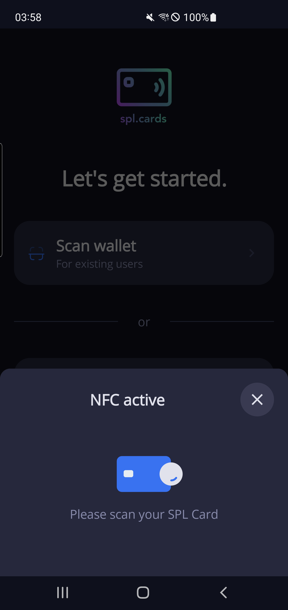
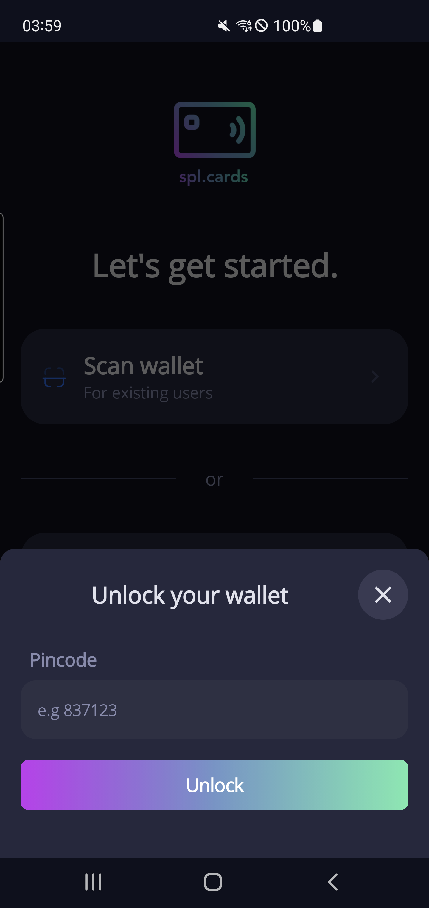
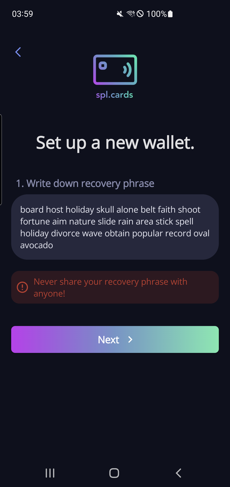
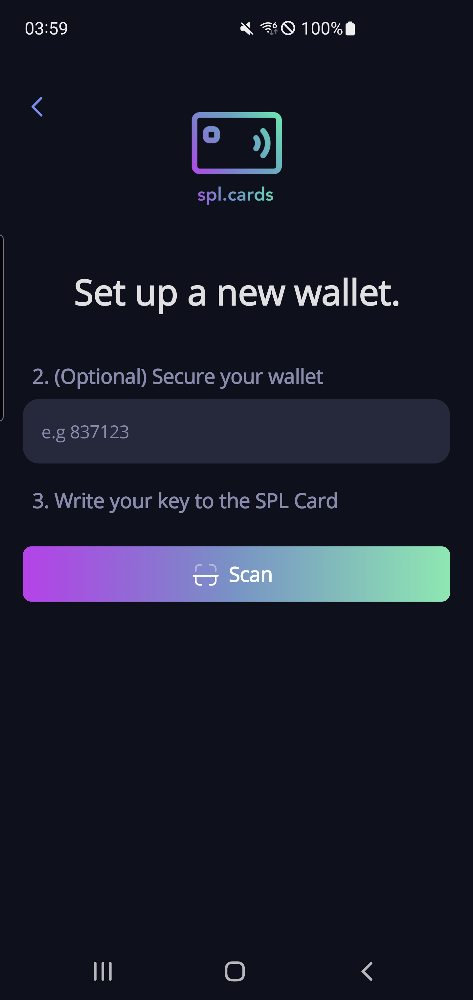

# SPL Cards - Android App - Screenshots

## Get Started - Page

Welcome to a secure and seamless start with SPL Cards. Log in to access your digital wallet or set up a new SPL Card with ease and full security without getting drained by the next wallet drainer.

## Scan SPL Card - Modal

Tap "Scan Wallet" to swiftly pair your SPL Card. Our intuitive scanning process ensures you're ready to transact in moments.

## Unlock Wallet - Modal

If your SPL Card is pin-protected, you'll need to enter your pin to access your funds, safeguarding your wallet at every step.

## Recovery Phrase - Page

Secure your financial future by safely storing your recovery phrase. This crucial step ensures that you always have access to your assets also when you should lose your SPL Card.

## Set Up Wallet - Page

Once your recovery phrase is secured, you may add an optional pin code for enhanced protection, then tap your SPL Card to initialize it, your gateway to a flexible financial world will begin now.

## Receive Token - Modal

Receiving tokens is a breeze with our Share feature. Distribute your public key to peers securely and start transacting instantly.

## Send Token - Modal

Send tokens with confidence. Our Send feature allows for precise transactions by simply entering the recipient's public key and the amount.

## Wallet Policy - Modal

Stay in control of your tokens with customizable wallet policies. Set allowed addresses and define transaction timings to align with your lifestyle and financial planning.

## Wrap Token - Modal

Take the first step in asset management with our Wrap feature, enabling you to apply policies and maintain control over your digital assets.

## Token Policy - Modal

Empower your wrapped tokens with customized spending limits and transaction rules. Our Token Policy modal offers the flexibility to safeguard and manage your assets effectively.
